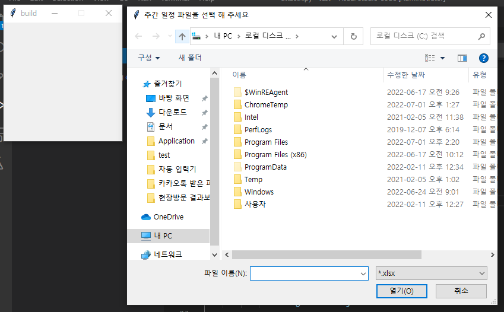
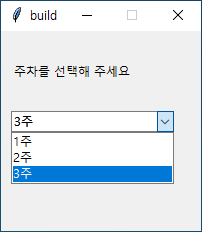
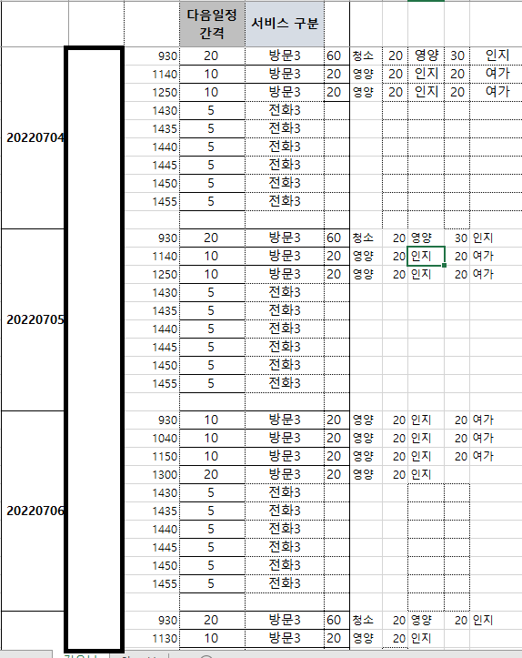

# exel_merge
사회복무요원 복무중 프로그램 사용을 위해 엑셀파일 2개를 붙여야 해서 간단하게 제작

## 사용모듈

openpyxl
tkinter

## 제작 동기
사회복무요원 복무중, 엑셀에 특정 부분을 붙여야 하는 경우가 발생.
단순작업을 간편히 해결하기위해 제작.
UI by tkinter

##사용화면

1.시작 화면 - 일정파일 선택

2.시작 화면2 - 서비스 제공자 파일 선택

3.간단한 main UI

4.병합전 서비스 제공자 파일

5.병합전 일정파일 상태

6. 두 파일중 필요 부분만 프로그램을 통해 병합
